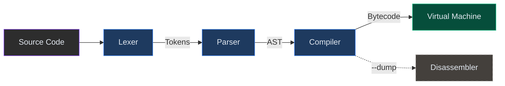

# CVM++

**CVM++** is a high-performance, stack-based virtual machine and compiler written from scratch in modern C++17. It features a complete pipeline — lexer, recursive-descent parser, single-pass compiler with constant folding, and a bytecode VM with strict runtime safety guarantees.

[](https://github.com/Komal-ai417/CVM-plus-plus/actions/workflows/ci.yml)

## Features

- **Stack-Based VM** — Executes tightly packed bytecode with bounded stack operations and runtime overflow/underflow protection.
- **Single-Pass Compiler** — Translates the AST directly into `std::vector<uint8_t>` bytecode in one linear pass.
- **Constant Folding** — Binary, unary, and logical expressions on literal operands are evaluated at compile time, eliminating runtime overhead.
- **Deep Block Scoping** — Full lexical scoping with variable shadowing. Nested scopes clean up automatically on exit.
- **Short-Circuit Evaluation** — `&&` and `||` skip the right operand when the result is already determined.
- **Bytecode Disassembler** — Human-readable bytecode dump via `--dump` flag or REPL `disasm on` command.
- **Interactive REPL** — Execute code line-by-line with full error recovery (compiler + VM state reset on error).
- **Portable Arithmetic** — Right shifts on negative integers use explicit sign-bit replication, avoiding implementation-defined C++ behavior.
- **Zero RTTI** — AST node identification uses a compile-time `NodeType` enum instead of `dynamic_cast`, enabling builds with `-fno-rtti`.

---

## Building

### Prerequisites

- A **C++17** compatible compiler (GCC 7+, Clang 5+, or MSVC 2017+)
- **CMake 3.10+**

### Build Instructions

```bash
git clone https://github.com/Komal-ai417/CVM-plus-plus.git
cd CVM-plus-plus

cmake -B build -DCMAKE_BUILD_TYPE=Release
cmake --build build --config Release
```

---

## Usage

### REPL Mode

Launch without arguments for an interactive session:

```bash
./build/cvm
> let x = 10;
> if (x > 5) { print x * 20; }
200
> disasm on
Bytecode disassembly enabled.
> print 1 + 2;
== Compiled Bytecode ==
0000  PUSH_INT        3
0005  PRINT
0006  HALT
3
```

**REPL commands:**

| Command       | Description                        |
| :------------ | :--------------------------------- |
| `exit`/`quit` | Exit the REPL                      |
| `disasm on`   | Enable bytecode disassembly output |
| `disasm off`  | Disable bytecode disassembly       |

### Script Execution

```bash
./build/cvm tests/fibonacci.cvm
./build/cvm tests/scope.cvm
./build/cvm tests/break_continue.cvm
```

### Bytecode Dump (inspect only)

Use `--dump` to print the compiled bytecode **without executing** the program:

```bash
./build/cvm --dump tests/fibonacci.cvm
```

> In the REPL, `disasm on` works differently — it prints the bytecode **and then executes** each line, so you can inspect what your code compiles to interactively.

---

## Language Reference

### Variables & Scoping

```javascript
let x = 42;
{
    let x = 100;    // shadows outer x
    print x;        // 100
}
print x;            // 42
```

### Control Flow

```javascript
if (x > 0) {
    print x;
} else {
    print -x;
}

while (x > 0) {
    x--;
}

for (let i = 0; i < 10; i++) {
    if (i == 5) continue;
    if (i == 8) break;
    print i;
}

// Empty clauses are valid
for (;;) {
    if (done) break;
}
```

### Operators

| Category       | Operators                                  |
| :------------- | :----------------------------------------- |
| **Arithmetic** | `+` `-` `*` `/` `%`                       |
| **Unary**      | `-` (negate) `+` (identity) `!` `~`       |
| **Update**     | `++` `--` (prefix and postfix)             |
| **Comparison** | `==` `!=` `<` `>` `<=` `>=`               |
| **Logical**    | `&&` `\|\|` `!`                            |
| **Bitwise**    | `&` `\|` `^` `<<` `>>` `~`               |

### Numeric Literals

```javascript
let dec = 255;
let hex = 0xFF;      // hexadecimal
let bin = 0b11111111; // binary
let oct = 0o377;     // octal
```

### Comments

```javascript
// Single-line comment

/* Multi-line
   block comment */
```

### I/O

```javascript
print 42;           // output: 42
let x = input;      // reads an integer from stdin
```

### Booleans

Booleans are a subset of integers. `true` is `1`, `false` is `0`. Any non-zero integer is truthy in conditional contexts. The `NORMALIZE` opcode converts any non-zero value to `1` for logical consistency:

```javascript
print true;         // 1
print false;        // 0
print true + 1;     // 2  (booleans are integers)
if (42) { print 1; } // 1 (non-zero = truthy)
```

---

## Architecture



| Layer            | File(s)                  | Description                                                                                         |
| :--------------- | :----------------------- | :-------------------------------------------------------------------------------------------------- |
| **Lexer**        | `lexer.cpp` `lexer.h`   | Tokenizes source text. Handles single-line/block comments, hex/binary/octal literals, and keywords. |
| **Parser**       | `parser.cpp` `parser.h` | Recursive-descent parser producing a typed AST. Uses `NodeType` enum for O(1) node identification.  |
| **Compiler**     | `compiler.cpp` `compiler.h` | Single-pass AST visitor emitting bytecode. Constant folding (binary, unary, logical) and short-circuit evaluation. |
| **VM**           | `vm.cpp` `vm.h`         | Stack-based interpreter with bounded operations, portable arithmetic shifts, and runtime error trapping. |
| **Disassembler** | `disasm.cpp` `disasm.h` | Pretty-prints bytecode with opcodes, operands, and absolute jump targets.                           |

---

## Tests

The `tests/` directory contains regression and feature tests:

| Test File                | Coverage                                      |
| :----------------------- | :--------------------------------------------- |
| `fibonacci.cvm`          | Loops, variables, arithmetic                   |
| `scope.cvm`              | Block scoping, variable shadowing              |
| `break_continue.cvm`     | Loop control flow                              |
| `inc_dec.cvm`            | Prefix/postfix increment and decrement         |
| `b1_int32min.cvm`        | INT32_MIN literal representation               |
| `b2_right_shift.cvm`     | Portable arithmetic right shift                |
| `b3_unary_plus.cvm`      | Unary plus operator                            |
| `b6_unary_folding.cvm`   | Compile-time unary constant folding            |
| `o2_logical_folding.cvm` | Logical expression constant folding            |
| `phase3_features.cvm`    | Block comments, hex/bin/oct, empty `for(;;)`   |

Run all tests:

```bash
# Linux/macOS
for f in tests/*.cvm; do echo "=== $f ===" && ./build/cvm "$f"; done

# Windows (PowerShell)
Get-ChildItem .\tests\*.cvm | ForEach-Object { Write-Host "=== $($_.Name) ===" ; .\build\cvm.exe $_.FullName }
```

---

## Contributing

We welcome contributions! Please see our [Contributing Guidelines](CONTRIBUTING.md) for details on how to build the project, our architectural rules, and the pull request process.

---

## License

This project is licensed under the **MIT License**. See the [LICENSE](LICENSE) file for details.
